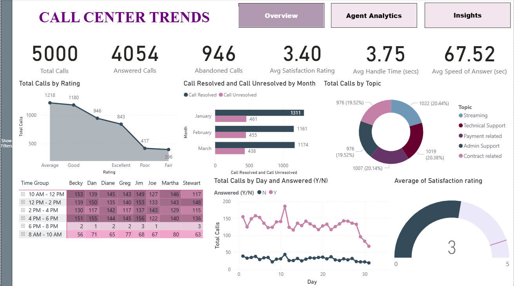
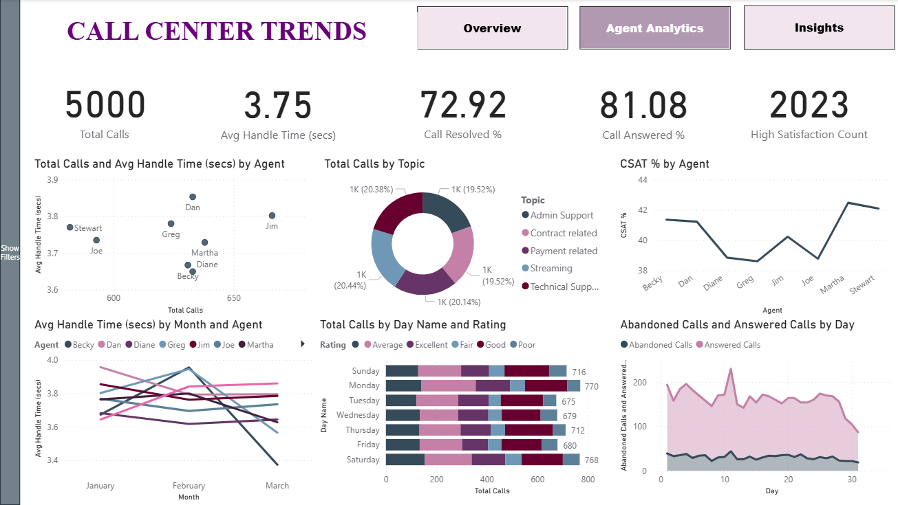
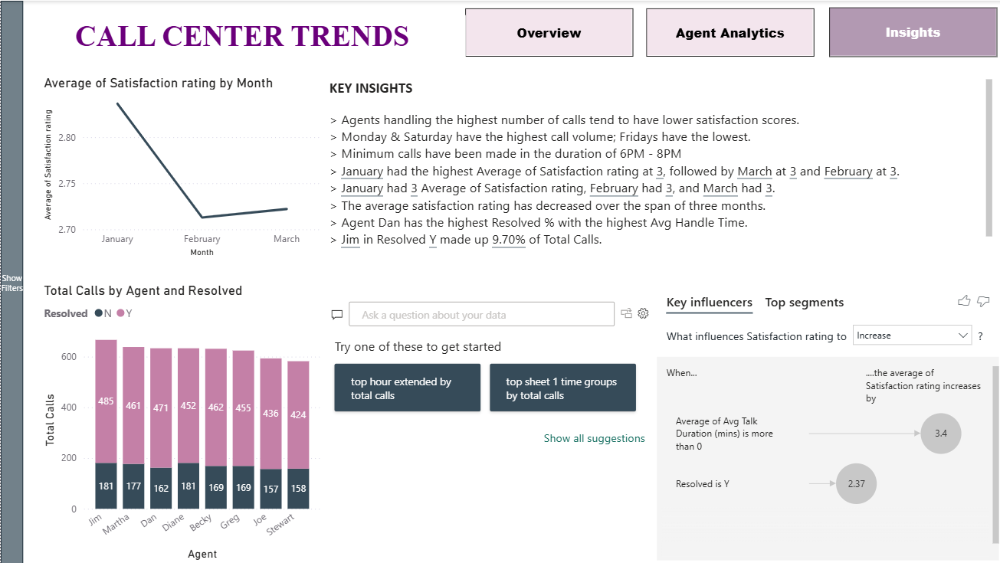
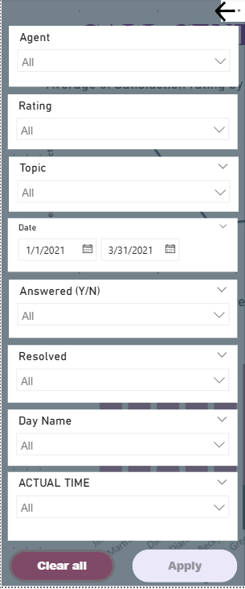

# ☎️ Call Center Performance Dashboard – Power BI

This project is a full-fledged, interactive Power BI dashboard analyzing key performance metrics for a simulated call center. It highlights call volume trends, agent performance, customer satisfaction, and operational insights across multiple time dimensions.

---

## 🚀 Project Overview

- 📞 Simulated dataset of 5,000+ call records
- 📈 3-page Power BI dashboard: Overview, Agent Analytics, Insights
- 🧠 Custom DAX measures and dynamic slicers
- 📊 Rich visuals: matrix heatmaps, KPIs, donut charts, key influencers
- 🧹 Full data cleaning & transformation pipeline (detailed below)

---

## 🧼 Data Cleaning & Transformation (Power Query Editor)

### Performed in Power BI using Power Query:

- 🕒 **Time Formatting**: Converted `AvgTalkDuration` from datetime to `hh:mm:ss` duration format for analysis.
- 📆 **Datetime Split**: Separated `Date` and `Time` columns for clearer trend analysis (time group, hourly heatmaps).
- 🚫 **Missing Values Handling**:
  - `Satisfaction rating`: Replaced nulls with `"No Rating"` using a derived label column.
  - Dropped or flagged rows missing `AvgTalkDuration` or `Resolved`.
- 📊 **Categorical Columns Normalized**:
  - Standardized Y/N columns like `Answered`, `Resolved` to consistent format.
- 🧠 **Derived Columns Created**:
  - `Delivery Status`: Categorized as “On Time” or “Late”
  - `Time Group`: Binned call times into 2-hour windows for heatmap visualization
  - `Day Name` and `Day No`: Extracted for trend breakdowns

---

## 📊 Dashboard Pages

### 1️⃣ Overview
- KPI cards: Total Calls, Answered, Abandoned, Avg CSAT, Avg Handle Time
- Donut chart for call topics
- Call resolution trend by month
- Matrix heatmap: Call volume by agent and time group
- Daily trend of answered vs unanswered calls

🖼️ 

---

### 2️⃣ Agent Analytics
- Avg handle time by agent
- Resolved % and CSAT % by agent
- Scatter plot: Avg handle time vs total calls
- Multi-line chart: Handle time trends by agent & month
- Day-wise call count by rating category

🖼️ 

---

### 3️⃣ Insights
- Key business insights (manually written)
- Key influencers visual: What drives satisfaction
- Trend line: Satisfaction rating over months
- Resolved call breakdown by agent

🖼️ 

---

### 🎛️ Interactive Slicer Panel

A collapsible slicer panel is built into the dashboard for seamless filtering across visuals.

**Filters Included:**
- 📅 **Date Range** (Placed Date)
- 👤 **Agent Name**
- 🌐 **Resolved (Y/N)**
- 📝 **Topic** (Contract, Technical Support, etc.)
- 📞 **Answered (Y/N)** and **Resolved (Y/N)**
- 🕒 **Time Group** (Grouped 2-hour call windows)
- ⭐ **Rating**
- 📆 **Day Name**
- 🕒 **Actual Time**
  
✅ This enables end-users and managers to drill into specific agents, time slots, or topics, making the dashboard dynamic and self-service-ready.

🧠 The slicer panel supports **cross-page filtering**, enhancing usability across Overview, Agent Analytics, and Insights tabs.

🖼️ 
---

## 📁 File Structure

Call-Center-PowerBI-Dashboard/
├── Call_Center_Trends.pbix # Main Power BI file
├── README.md # Project documentation
├── Screenshots # Dashboard images
├── Dataset #Uncleaned Dataset

---

## 📌 Key Metrics & DAX Measures

- `Call Volume`, `Answered %`, `Abandoned Count`
- `Avg Talk Duration`, `Avg Speed of Answer`
- `Satisfaction Score`, `Resolution %`
- `Best/Worst Performing Agent` (by CSAT & Handle Time)
- Influencer: Effect of handle time & resolution on satisfaction

---

## 💡 Key Insights

- Agents with the **highest call volume** often show **lower satisfaction scores**.
- **Monday & Saturday** show peak call activity.
- Most calls are concentrated between **10 AM – 4 PM**.
- Agent **Dan** has the highest resolution %, but also the **highest average handle time**.
- Satisfaction ratings have **declined** gradually over the quarter.

---

## 🛠 Tools Used

- Power BI Desktop
- Power Query Editor (data transformation)
- DAX for calculated columns & KPIs
- Visuals: Matrix, Card, Donut, Line, Combo, Key Influencer

---

## 👩‍💻 Author

**Shruti**  
Data Analyst | Power BI Enthusiast  
🔗 [LinkedIn](https://linkedin.com/in/shrutivnair) | 📂 [GitHub](https://github.com/ShrutiVNair)

---

## 📬 Contact

📫 Email: shrutinair.v.31@gmail.com

---

> 💡 **Note**: This project is for learning and demonstration purposes based on a simulated call center dataset.
